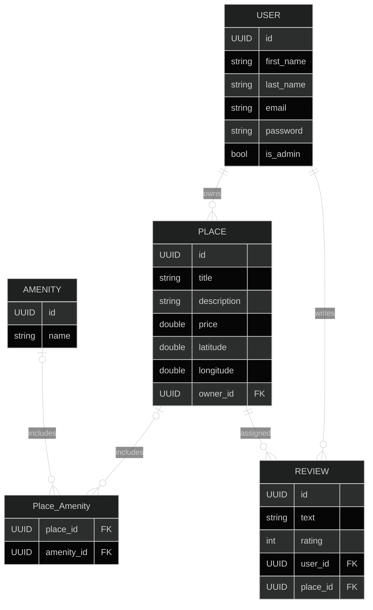

# HBnB Project Setup

## 🔖 Table of contents

<details>
  <summary>
    CLICK TO ENLARGE 😇
  </summary>
  📄 <a href="#description">Description</a>
  <br>
  📂 <a href="#files-description">Files description</a>
  <br>
  💻 <a href="#installation">Installation</a>
  <br>
  🔧 <a href="#whats-next">What's next?</a>
</details>

## 📄 <span id="description">Description</span>

This project now provides the Part 3 HBnB backend as a working Flask API with SQLAlchemy persistence, JWT authentication, Swagger documentation, and automated tests.

The application still follows the same layered organization across the Presentation, Business Logic, and Persistence layers, and it still uses the Facade pattern to centralize interactions between routes, models, and repositories. The main difference is that the old in-memory persistence has been replaced by a real SQLAlchemy-backed repository, and write operations are now protected with JWT-based authorization rules.

## 📂 <span id="files-description">Files description</span>

| **FILE / DIRECTORY** | **DESCRIPTION** |
| :-----------------: | ------------------------------------------------- |
| `app/` | Contains the core application code |
| `app/api/` | Houses the versioned API endpoints |
| `app/models/` | Contains SQLAlchemy models and validation logic for `user.py`, `place.py`, `review.py`, and `amenity.py` |
| `app/services/` | Contains the Facade implementation and service-level repositories |
| `app/persistence/` | Contains the generic SQLAlchemy repository implementation |
| `tests/` | Contains the automated API test suite |
| `sql/` | Contains SQL schema and sample data files |
| `run.py` | Serves as the entry point for running the Flask application |
| `config.py` | Stores Flask, JWT, and database configuration |
| `requirements.txt` | Lists required Python packages |
| `README.md` | Provides a project overview, setup steps, endpoint summary, and testing guide |

## 💻 <span id="installation">Installation</span>

1. **Clone the repository to your local machine:**
```bash
git clone https://github.com/Handroc/holbertonschool-hbnb.git
```

2. **Move into the project directory and install dependencies:**

```bash
cd holbertonschool-hbnb/part3/hbnb
python3 -m venv .venv
source .venv/bin/activate
pip install -r requirements.txt
```

3. **Run the application:** Execute the entry point script to start the Flask server.

```bash
python3 run.py
```

3. **Open the API documentation:** Once the server is running, Swagger is available at:

```text
http://localhost:5000/
```

The API base path is:

```text
http://localhost:5000/api/v1
```

Default development behavior:

- SQLite database: `development.db`
- Default admin email: `admin@hbnb.io`
- Default admin password: `admin1234`

## 🚀 API Endpoints Integration

### 0. 🗂️ Project Setup

- Modular folders:
  - `api/` for route definitions
  - `models/` for business entities and validation
  - `services/` for the Facade layer
  - `persistence/` for SQLAlchemy repositories
- Flask-RESTX initialized with Swagger UI
- Swagger auto-generates documentation from defined models
- Flask-SQLAlchemy manages persistence through a SQLite development database
- Flask-JWT-Extended protects authenticated endpoints
- A default admin account is seeded automatically on startup

---

### 1. 🧠 Business Models

- **BaseModel**: common fields (`id`, `created_at`, `updated_at`)
- **User**: `first_name`, `last_name`, `email`, hashed `password`, `is_admin`
- **Place**: `title`, `description`, `price`, `latitude`, `longitude`, owner, amenities, reviews
- **Amenity**: name of a feature such as WiFi, Parking, or Pool
- **Review**: `text`, `rating`, linked to a `User` and a `Place`
- Relationship management:
  - One-to-many between users and places
  - One-to-many between users and reviews
  - One-to-many between places and reviews
  - Many-to-many between places and amenities
- Validation rules are enforced inside the model layer

### Data Model in the form of a ER diagram



---

### 2. 👤 User Endpoints

| **Method** | **Endpoint** | **Description** |
|:----------:|-------------|-----------------|
| POST | `/api/v1/users/` | Create a user account, admin token required |
| GET | `/api/v1/users/` | Retrieve all users without passwords |
| GET | `/api/v1/users/{id}` | Get user by ID |
| GET | `/api/v1/users/email/{email}` | Get user by email |
| PUT | `/api/v1/users/{id}` | Update a user, allowed for self or admin |
| DELETE | `/api/v1/users/{id}` | Delete a user, allowed for self or admin |

Notes:

- Regular users cannot change their own `email`, `password`, or `is_admin`
- Admins can reset another user's password
- Passwords are never exposed in API responses

---

### 3. 🏷️ Amenity Endpoints

| **Method** | **Endpoint** | **Description** |
|:----------:|-------------|-----------------|
| POST | `/api/v1/amenities/` | Create an amenity, admin token required |
| GET | `/api/v1/amenities/` | List all amenities |
| GET | `/api/v1/amenities/{id}` | Get a specific amenity |
| PUT | `/api/v1/amenities/{id}` | Update amenity details, admin token required |
| DELETE | `/api/v1/amenities/{id}` | Delete an amenity, admin token required |

Notes:

- Amenity names must be unique
- Deleting an amenity removes its link from related places

---

### 4. 🏠 Place Endpoints

| **Method** | **Endpoint** | **Description** |
|:----------:|-------------|-----------------|
| POST | `/api/v1/places/` | Create a place, user token required |
| GET | `/api/v1/places/` | List all places |
| GET | `/api/v1/places/{id}` | Get place by ID including owner and amenities |
| GET | `/api/v1/places/{id}/reviews` | Get all reviews for a specific place |
| PUT | `/api/v1/places/{id}` | Update place details, owner or admin only |
| DELETE | `/api/v1/places/{id}` | Delete a place, owner or admin only |

Notes:

- The authenticated user becomes the owner of the place
- Any `owner_id` sent in the request payload is overwritten by the JWT identity
- All amenity IDs must exist before they can be attached to a place

---

### 5. 📝 Review Endpoints

| **Method** | **Endpoint** | **Description** |
|:----------:|-------------|-----------------|
| POST | `/api/v1/reviews/` | Create a review, user token required |
| GET | `/api/v1/reviews/` | List all reviews |
| GET | `/api/v1/reviews/{id}` | Get review by ID |
| PUT | `/api/v1/reviews/{id}` | Update a review, author or admin only |
| DELETE | `/api/v1/reviews/{id}` | Delete a review, author or admin only |

Notes:

- The authenticated user becomes the author of the review
- Any `user_id` sent in the request payload is overwritten by the JWT identity
- A user cannot review their own place
- A user can review a given place only once

---

# 🧪 HBnB API Testing Guide

This section describes how to run unit tests and perform manual testing using `curl` for the current Flask REST API.

---

## 📦 Project Structure (Testing)

```text
holbertonschool-hbnb/
├── part3/
│   └── hbnb/
│       ├── app/
│       ├── tests/
│       │   ├── __init__.py
│       │   ├── helpers.py
│       │   ├── test_auth.py
│       │   ├── test_users.py
│       │   ├── test_places.py
│       │   ├── test_amenities.py
│       │   ├── test_reviews.py
│       │   ├── test_protected.py
│       │   ├── test_payload_and_validation.py
│       │   └── test_cascading_deletes.py
│       ├── config.py
│       ├── requirements.txt
│       └── run.py
```

---

## 🧪 Running Unit Tests

### ✅ Run All Tests

Make sure your virtual environment is activated, then run:

```bash
cd holbertonschool-hbnb/part3/hbnb
python3 -m unittest discover tests
```

Expected result:

```text
Ran 47 tests in ...
OK
```

---

## 🚀 Start the Flask API Server

Before using `curl`, run your Flask API server:

```bash
cd holbertonschool-hbnb/part3/hbnb
python3 run.py
```

Make sure it is running at:

```text
http://localhost:5000
```

Swagger documentation is available at:

```text
http://localhost:5000/
```

---

## 🧪 Manual Testing with curl

### 0️⃣ Authenticate as the seeded admin

This token is required before creating users and amenities.

```bash
curl -X POST http://localhost:5000/api/v1/auth/login \
-H "Content-Type: application/json" \
-d '{
  "email": "admin@hbnb.io",
  "password": "admin1234"
}'
```

---

### 1️⃣ Create a User

```bash
curl -X POST http://localhost:5000/api/v1/users/ \
-H "Content-Type: application/json" \
-H "Authorization: Bearer ADMIN_TOKEN" \
-d '{
  "first_name": "Claire",
  "last_name": "Obscure",
  "email": "claire@example.com",
  "password": "Secret123!"
}'
```

Then log in as that user to get a user token:

```bash
curl -X POST http://localhost:5000/api/v1/auth/login \
-H "Content-Type: application/json" \
-d '{
  "email": "claire@example.com",
  "password": "Secret123!"
}'
```

---

### 2️⃣ Create an Amenity

```bash
curl -X POST http://localhost:5000/api/v1/amenities/ \
-H "Content-Type: application/json" \
-H "Authorization: Bearer ADMIN_TOKEN" \
-d '{"name": "WiFi"}'
```

Repeat for other amenities like `"Air Conditioning"` or `"Parking"`.

🔍 List amenities and retrieve their IDs:

```bash
curl http://localhost:5000/api/v1/amenities/
```

---

### 3️⃣ Create a Place
*(Use a valid user token and existing amenity IDs)*

```bash
curl -X POST http://localhost:5000/api/v1/places/ \
-H "Content-Type: application/json" \
-H "Authorization: Bearer USER_TOKEN" \
-d '{
  "title": "Charming Loft",
  "description": "A cozy loft in the city center",
  "price": 120.5,
  "latitude": 48.8566,
  "longitude": 2.3522,
  "owner_id": "ignored-by-api",
  "amenities": ["AMENITY_ID_1", "AMENITY_ID_2"]
}'
```

`owner_id` is ignored by the API and replaced with the authenticated user's ID.

---

### 4️⃣ Create a Review

Use a different authenticated user from the place owner.

```bash
curl -X POST http://localhost:5000/api/v1/reviews/ \
-H "Content-Type: application/json" \
-H "Authorization: Bearer REVIEWER_TOKEN" \
-d '{
  "text": "Great location and clean space!",
  "rating": 5,
  "user_id": "ignored-by-api",
  "place_id": "PLACE_ID"
}'
```

`user_id` is ignored by the API and replaced with the authenticated user's ID.

---

## 📖 Additional GET Examples

### List all users

```bash
curl http://localhost:5000/api/v1/users/
```

### Get a user by ID

```bash
curl http://localhost:5000/api/v1/users/<user_id>
```

### Get a user by email

```bash
curl http://localhost:5000/api/v1/users/email/<email>
```

### List all places

```bash
curl http://localhost:5000/api/v1/places/
```

### Get a place by ID

```bash
curl http://localhost:5000/api/v1/places/<place_id>
```

### Get all reviews for a place

```bash
curl http://localhost:5000/api/v1/places/<place_id>/reviews
```

---

## ✅ Testing Summary

| **Test Type** | **Description** | **Command / URL** |
|:-------------:|----------------|-------------------|
| Unit Tests | Run the Part 3 Python unittest suite | `python3 -m unittest discover tests` |
| Manual API Test | Run the server and use authenticated `curl` requests | `curl -X ...` |
| API Documentation | Swagger UI generated by Flask-RESTX | `http://localhost:5000/` |

---


## 🔧 <span id="whats-next">What's next?</span>

- Implement HTML and CSS to the project for a proper interface
